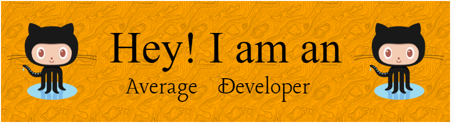

## **About me**

I am a python devloper currently learning C and DSA, <br>I also joined college recently and am looking forward to making a lot of projects.

I am interested by new tech and I learn better by exploring and learning in fasination.

You can contact me via Discord ```DishantOfficial#1623```

<div align="center">

<table>
  <tr >
    <td>
    </td>
    <td></td>
  </tr>
  
  <tr>
    <td colspan="2" align="center" ></img>
    </td>
</table>


## **🐍Languages I used or tried**


## **🛠 Tools and Resources I love to use !**


## **🔗 Links**
[](https://www.linkedin.com/in/dishant-kapoor-35ab9a166)
[](https://twitter.com/DudeAmpli)


<p align="center"><b>Visits</b><br>
  
</p>


<!-- [](https://github.com/harish-sethuraman/readme-components)
[](https://github.com/harish-sethuraman/readme-components)
[](https://github.com/harish-sethuraman/readme-components)
[](https://github.com/harish-sethuraman/readme-components)
[](https://github.com/harish-sethuraman/readme-components)
[](https://github.com/harish-sethuraman/readme-components)
[](https://github.com/harish-sethuraman/readme-components)
[](https://github.com/harish-sethuraman/readme-components) -->